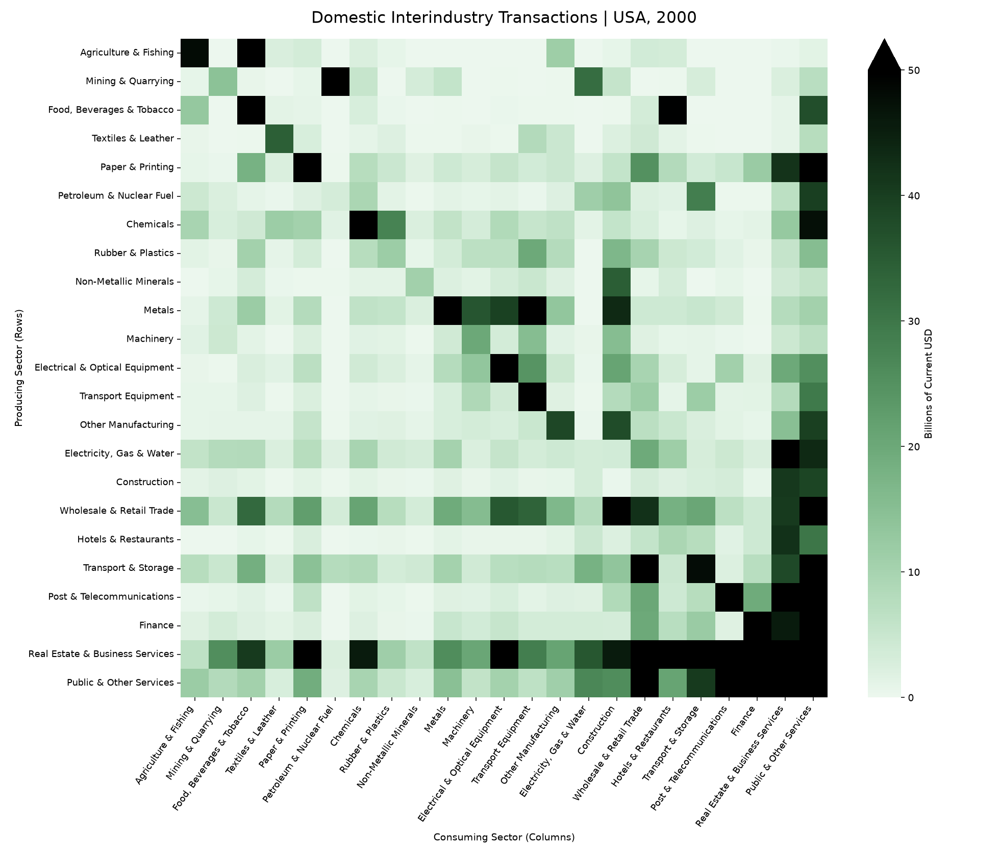
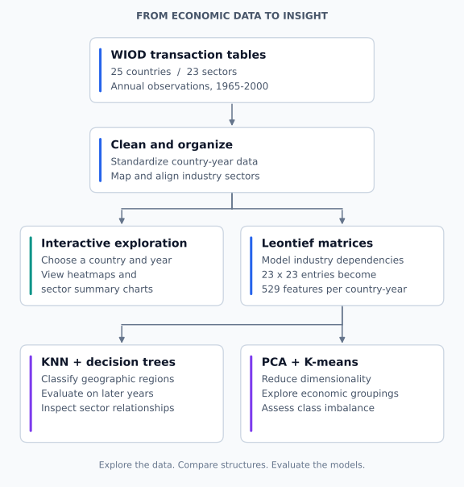
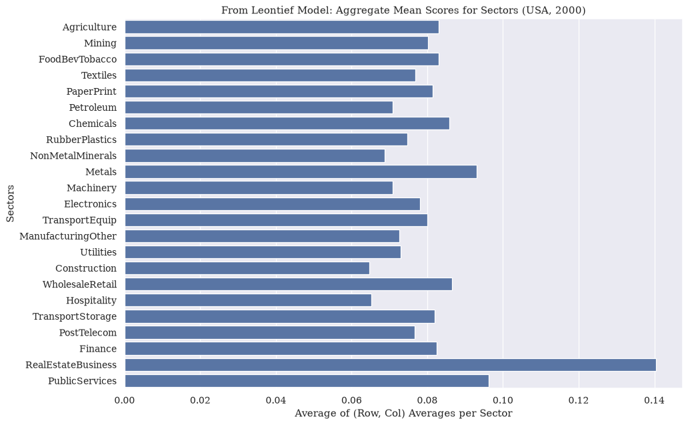
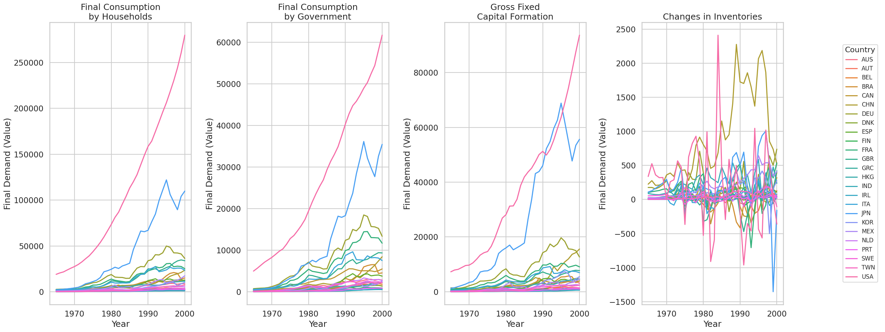
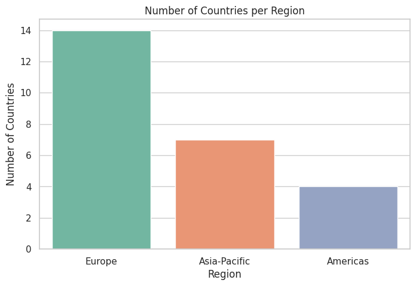

# Economic Input-Output Model

**Exploring how industries connect, and what those connections reveal about regional economies.**

Rutgers University · CS 439 · December 2025

**1st place among 30+ teams in a coursewide competition · Presented to 200+ students**

This team project turns decades of World Input-Output Database (WIOD) transactions into country-year datasets, visualizes sector relationships, and uses Leontief inverse matrices as features for machine learning. We investigated whether economic structure distinguishes geographic regions and whether those patterns persist in later years.

**25 countries · 23 sectors · 1965–2000 · Python / Pandas / NumPy / scikit-learn / Matplotlib / Seaborn**

[Explore the notebook](econ_input_output.ipynb) · [Read the presentation](Economic%20Input-Output%20Model.pdf) · [Results & methodology](docs/methodology.md) · [Setup & reproduction](docs/reproduction.md)

## A look inside



*A freshly executed notebook output from the country/year query: China, 2000. Flows are shown in billions of current US dollars; the fixed color scale saturates at 50 billion.*

## My contribution

I'm **[Ryan Vukicevic](https://github.com/RyanVukicevic)**. I led our three-person team and focused on making the economic data usable, interpretable, and explorable:

- **Data cleaning and restructuring:** transformed the wide WIOD transaction tables into standardized country-year datasets, mapped sector codes to readable names, and organized the data for analysis.
- **Visual analysis:** developed heatmaps and bar charts to communicate intersectoral flows and sector-level summaries.
- **Interactive exploration:** built notebook prompts that let viewers select a country and year to query the data and display visualizations.
- **ML guidance:** advised the team's choice of algorithms for regional classification, dimensionality reduction, and clustering.

The modeling results below are **team outcomes**. The project was completed with **Lawrence Ho** and **Paolo Gervasoni**; see [team credits](docs/credits.md).

## What we built



The economic model relates total output **x**, intermediate input coefficients **A**, and final demand **y**:

$$x = Ax + y, \qquad L = (I-A)^{-1}, \qquad x = Ly$$

Each 23 × 23 Leontief matrix becomes a 529-feature representation of a country's sector relationships. The team compared three regional labels—Europe, Asia-Pacific, and Americas—and explored alternative East/West groupings.

## Verified local run

**81 code cells executed successfully | 900 matrices validated | 54 saved charts | 0 execution errors**

The restored project ran end to end in approximately **5.5 minutes** on the local environment. It reads the CSV directly and rebuilds its matrix cache automatically.

| Experiment | New test accuracy | Evaluation |
| --- | ---: | --- |
| KNN, full Leontief features | **93.2%** | Train 1965-1990; evaluate 1991-2000 |
| KNN with 7-component PCA | **84.4%** | Same temporal split |
| Decision tree | **97.2%** | Random 80/20 country-year split |

These are exploratory rerun results after the documented corrections, with remaining evaluation limitations described below. See the [execution record](outputs/run_summary.json) for the input checksum, package versions, and recorded metrics.



*The country/year query also produces a sector summary. This chart averages row and column means of the Leontief matrix; it is a descriptive linkage score, not a causal importance measure.*

## Original presentation findings

The following are **results reported in the original presentation**, not newly reproduced benchmarks.

| Experiment | Reported test accuracy | Evaluation |
| --- | ---: | --- |
| KNN, full Leontief features | **94.8%** | Train on 1965–1990; evaluate on 1991–2000 |
| KNN with 7-component PCA | **86.4%** | Same year-based split |
| Decision tree | **98.3%** | Random 80/20 split across country-year observations |

- **Later-year classification retained useful signal.** KNN classified regional labels from later economic structures with 94.8% reported accuracy. This measures classification of observed later-year matrices, not forecasting future output or GDP.
- **Compression had a measurable tradeoff.** The PCA variant reduced temporal test accuracy by **8.4 percentage points**, suggesting that the retained components did not preserve all useful classification information in this experiment.
- **Clustering exposed a different challenge.** K-means did not recover the three geographic regions cleanly; larger classes dominated many assignments. Region coverage was uneven: 14 European, 7 Asia-Pacific, and 4 Americas countries.

These are historical slide results. The current notebook rebuilds matrices from the local CSV using reported gross output and corrects the clustering refit/PCA bugs. Its new results are saved separately from the presentation. Random splits still include repeated countries, and some preprocessing occurs before splitting; see [methodology notes](docs/methodology.md) for the remaining limitations.

## Explore the project

**No setup needed:** open the [52-slide presentation](Economic%20Input-Output%20Model.pdf) for the complete story or browse the [notebook](econ_input_output.ipynb) for the implementation and saved visual outputs.

| Interested in… | Start here |
| --- | --- |
| Data preparation | Notebook: **Data Prepreparation → Sector Mapping → Subsetting by Country** |
| My interactive visualizations | Notebook: **Heatmap**, **Leontief**, and **Interactive Demo Functions** |
| Model comparison | Presentation, slides **19–39** |
| Later-year evaluation | Presentation, slides **26–30** |
| Class imbalance and alternative labels | Presentation, slides **40–49** |
| Technical details and limitations | [Methodology](docs/methodology.md) |

## Run locally

Place `lr_wiod_wiot_wide.csv` in the repository folder, install the dependencies in a Python virtual environment, then run:

```bash
python -m pip install -r requirements.txt
python run_notebook.py
```

This executes the full notebook in a fresh kernel, rebuilds all **900 Leontief matrices**, saves charts and model outputs in the notebook, and writes a verification record to [`outputs/run_summary.json`](outputs/run_summary.json). No Google Drive mount or precomputed cache is required. The dataset stays local because it exceeds GitHub's normal file-size limit; [setup instructions](docs/reproduction.md) explain how to obtain it on another computer.

For interactive exploration, open `econ_input_output.ipynb` in JupyterLab and run all cells. Call `heatmap_demo()` or `leontief_demo()` to query a country and year; the default demo cells use examples so Run All does not wait for input.

<details>
<summary><strong>More original visualizations: demand trends and regional coverage</strong></summary>



*The notebook summarizes demand components across sector rows for each country and year. Values are nominal; these curves are not inflation-adjusted growth estimates.*



*Regional coverage provides context for the class-imbalance analysis.*

</details>

## Repository guide

```text
econ_input_output.ipynb          Locally runnable team notebook and new outputs
econ_input_output.py             Synchronized local Python export
run_notebook.py                  Fresh-kernel execution and verification record
Economic Input-Output Model.pdf  Original team presentation
requirements.txt                Local analysis and notebook dependencies
outputs/run_summary.json        Completed-run record and recorded metrics
docs/
  methodology.md                Results, experiment design, and limitations
  reproduction.md               Data requirements and execution notes
  credits.md                    Contributions and source attribution
  images/                       Figures extracted from saved notebook outputs
```

## Data and acknowledgments

Data: [Long-run WIOD, University of Groningen](https://www.rug.nl/ggdc/valuechain/long-run-wiod), version 1.1. The source covers 1965–2000, including 25 countries and a rest-of-world category. Our analysis selects domestic country blocks and excludes rest-of-world and total rows.

Required data attribution: Woltjer, P., Gouma, R., and Timmer, M. P. (2021), *Long-run World Input-Output Database: Version 1.1 Sources and Methods*, GGDC Research Memorandum 190. [Dataset DOI](https://doi.org/10.34894/A7AXDN).

The presentation and preview images preserve the course-project results. The notebook and Python export have since been adapted for local execution and corrected where documented; original versions remain in Git history. Portfolio documentation was added afterward. Competition placement and audience size are reported by Ryan; the repository does not contain separate award documentation. Dataset terms and team attribution are detailed in [credits](docs/credits.md).
