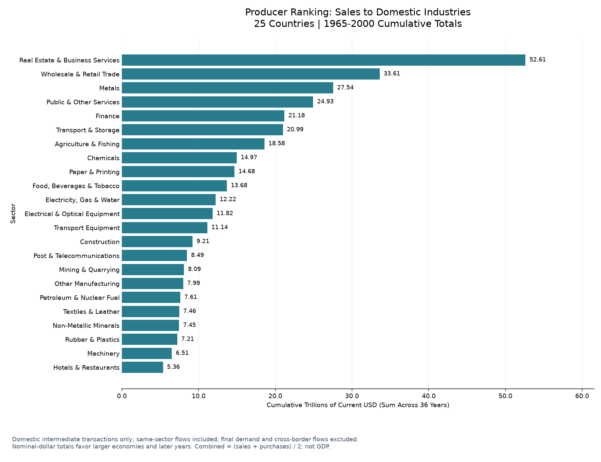
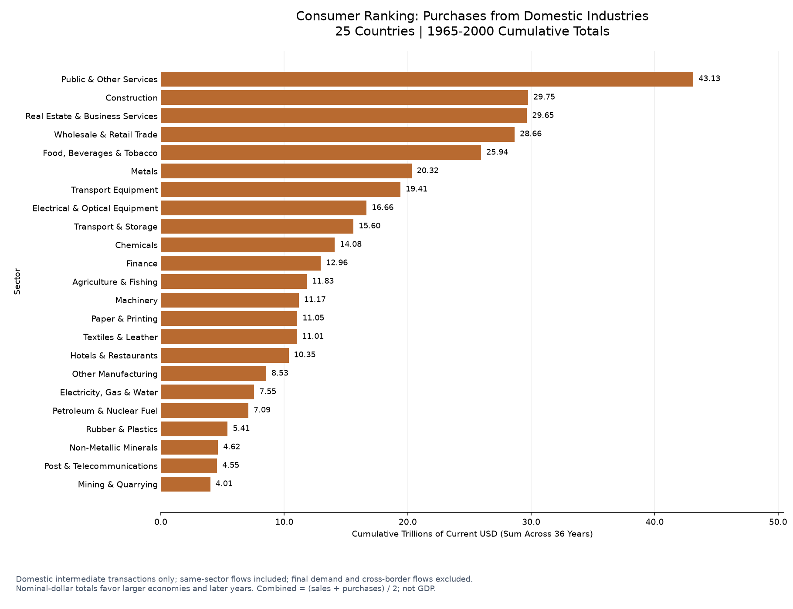
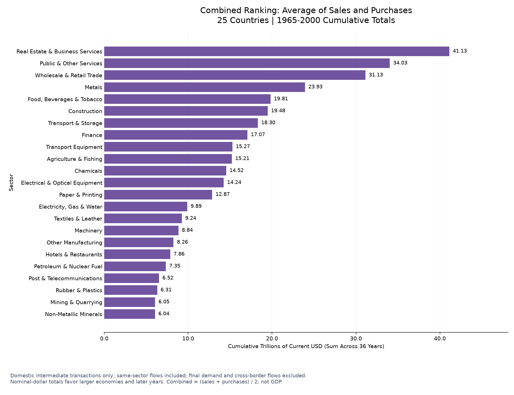
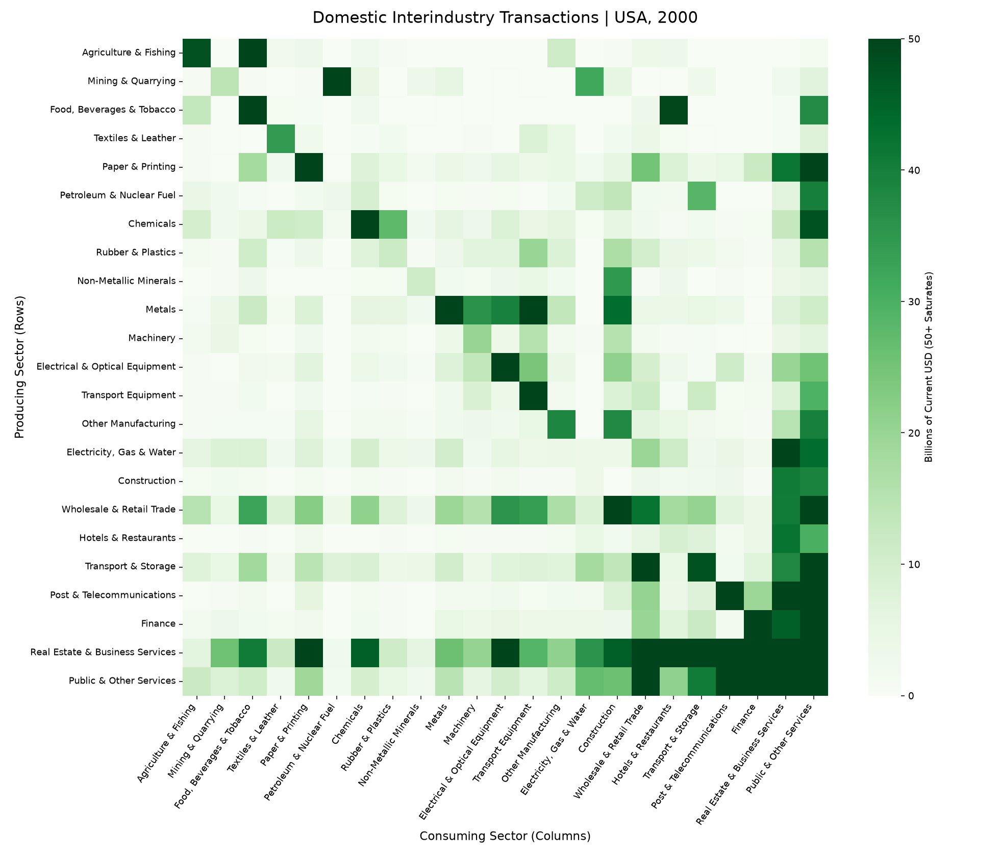
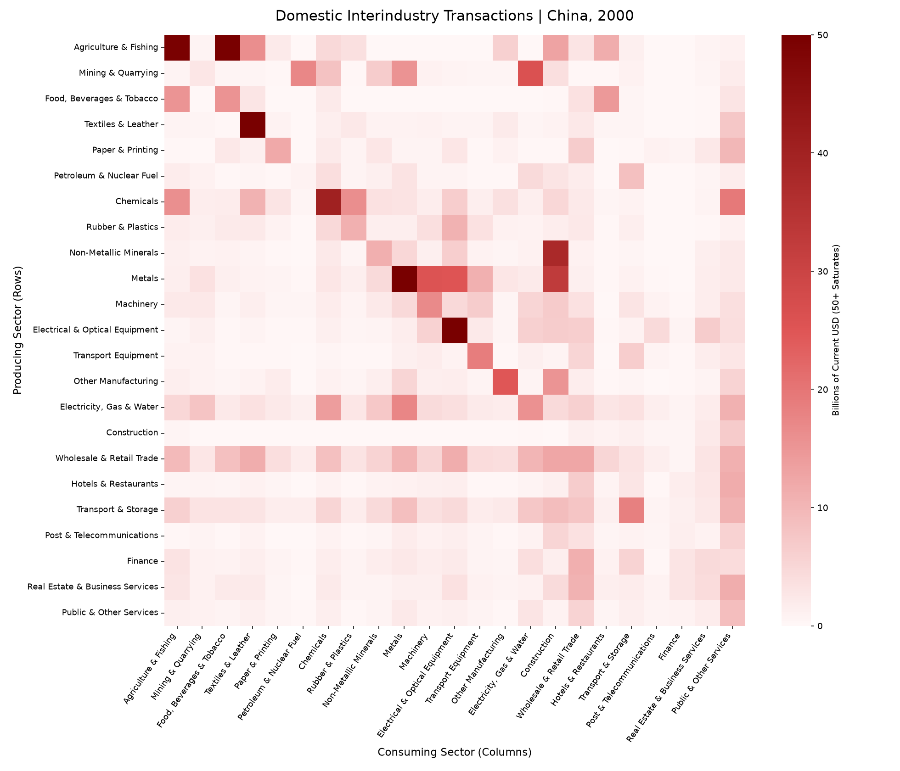
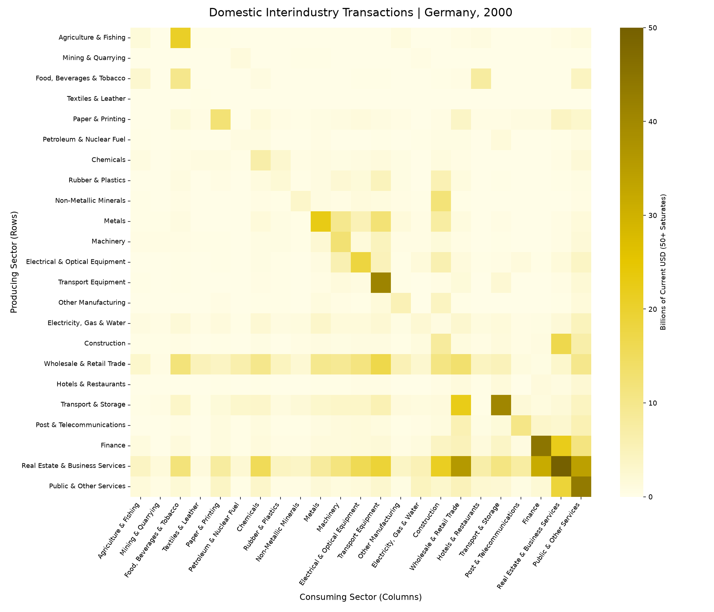

# Economic Structure Classification Model

**Exploring how industries connect, and what those connections reveal about regional economies.**

Rutgers University · CS 439 · December 2025

**1st place among 30+ teams in a coursewide competition · Presented to 200+ students**

This team project turns decades of World Input-Output Database (WIOD) transactions into country-year datasets, visualizes sector relationships, and uses Leontief inverse matrices as features for machine learning. We investigated whether economic structure distinguishes geographic regions and whether those patterns persist in later years.

**25 countries · 23 sectors · 1965–2000 · Python / Pandas / NumPy / scikit-learn / Matplotlib / Seaborn**

[Explore the notebook](economic_structure_classification_model.ipynb) · [Read the presentation](Economic%20Structure%20Classification%20Model.pdf) · [Results & methodology](docs/methodology.md) · [Setup & reproduction](docs/reproduction.md)

## What we built

Our goal was to understand how industry relationships differ across economies and test whether those patterns distinguish geographic regions over time. We cleaned the transaction data, made it explorable through country/year queries, and converted sector relationships into features for classification and clustering.


The economic model relates total output **x**, intermediate input coefficients **A**, and final demand **y**:

$$x = Ax + y, \qquad L = (I-A)^{-1}, \qquad x = Ly$$

Each 23 × 23 Leontief matrix becomes a 529-feature representation of a country's sector relationships. The team compared three regional labels—Europe, Asia-Pacific, and Americas—and explored alternative East/West groupings.

## My contribution

I'm **[Ryan Vukicevic](https://github.com/RyanVukicevic)**. I led our three-person team and focused on making the economic data usable, interpretable, and explorable:

- **Data cleaning and restructuring:** transformed the wide WIOD transaction tables into standardized country-year datasets, mapped sector codes to readable names, and organized the data for analysis.
- **Visual analysis:** developed heatmaps and bar charts to communicate intersectoral flows and sector-level summaries.
- **Interactive exploration:** built notebook prompts that let viewers select a country and year to query the data and display visualizations.
- **ML guidance:** advised the team's choice of algorithms for regional classification, dimensionality reduction, and clustering.

The modeling results below are **team outcomes**. The project was completed with **Lawrence Ho** and **Paolo Gervasoni**; see [team credits](docs/credits.md).

## A look inside

### Which Sectors Account for the Most Domestic Industry Trade?

These rankings summarize **25 countries, 23 sectors, and 36 years (1965-2000)** using the original monetary transaction data. They show which sectors account for the largest cumulative sales and purchases within domestic production networks.

For each country and year, we select its domestic 23 x 23 transaction matrix: **rows sell; columns buy**. For each sector, we sum its row to measure producer sales and its column to measure consumer purchases, then add those totals across all **900 country-year observations**. Source values in millions of current USD are converted to **trillions** for the pooled charts.

#### Producer Sales



**Real Estate & Business Services leads with $52.61 trillion**, followed by Wholesale & Retail Trade ($33.61 trillion). This view highlights the sectors supplying the greatest dollar volume of inputs to domestic industries over the observed period.

#### Consumer Purchases



**Public & Other Services leads with $43.13 trillion**, followed by Construction ($29.75 trillion). Here, "consumer" means an industry purchasing inputs, not household spending. This view identifies the sectors drawing the largest dollar volume of inputs from domestic suppliers.

#### Combined Sales and Purchases



Each bar is **(cumulative producer sales + cumulative consumer purchases) / 2**. Real Estate & Business Services ranks first ($41.13 trillion), followed by Public & Other Services ($34.03 trillion). Averaging the two directions gives equal weight to a sector's roles as supplier and buyer; it is a summary measure, not an additional transaction total.

All three charts include same-sector transactions and exclude cross-border flows and final demand such as household purchases. They describe **gross intermediate transactions, not profit, value added, or GDP**. Values are nominal and not inflation-adjusted, so larger economies and later-year dollar amounts carry more weight. Rankings describe transaction scale rather than productivity or real growth.

### Comparing Domestic Production Networks: Heatmaps for 2000

How do the individual industry relationships differ across countries? These heatmaps query the notebook for **USA, China, and Germany in 2000**, providing an Americas, Asia-Pacific, and Europe example from the regions used in our classification models. Germany was the world's third-largest economy by nominal GDP in 2000, after the USA and Japan ([World Bank, GDP in current US dollars](https://databank.worldbank.org/GDP-nominal-1972-2009/id/4cbd752b)). This selection keeps the requested USA/China comparison and adds Germany; it is not a comparison of the three largest economies. Russia is not included in this dataset.

Each cell shows a producing sector's sales to a consuming sector in **billions of current USD**: rows sell and columns buy. Read across a row to see a sector's buyers, or down a column to see its suppliers. These are original domestic transactions, including same-sector flows; cross-border trade and final demand are excluded.

All three use **the same sector order and linear $0-50 billion scale**. Light means smaller flows; dark means larger flows. Values above $50 billion share the darkest shade. Different palettes identify the countries, so compare cell positions and colorbar values rather than hues. Absolute dollar differences also reflect economy size; these are not normalized measures of economic structure.

#### USA, 2000



*Dollar-green identifies the USA. Follow the Real Estate & Business Services and Public & Other Services rows and columns to explore their connections with the rest of the economy.*

#### China, 2000



*Red identifies China. Compare manufacturing-sector cells and the Construction column with the corresponding positions in the USA heatmap to explore differences in domestic supply relationships.*

#### Germany, 2000



*Grayscale, drawing on black in Germany's flag, identifies the European example. Compare Metals, Machinery, and Transport Equipment relationships across the three countries.*

Together, the pooled rankings summarize transaction scale across the full dataset, while these heatmaps reveal the individual country/year relationships from which we build economic-structure features. [More on chart units and interpretation](docs/reading-the-charts.md).

Regenerate the three rankings and three notebook heatmap queries with `python docs/render_showcase.py` after [setting up the local dataset](docs/reproduction.md).

## Verified local run

**81 code cells executed successfully | 900 matrices validated | 54 saved charts | 0 execution errors**

The restored project ran end to end in approximately **3.6 minutes** on the local environment. It reads the CSV directly and rebuilds its matrix cache automatically.

| Experiment | New test accuracy | Evaluation |
| --- | ---: | --- |
| KNN, full Leontief features | **93.2%** | Train 1965-1990; evaluate 1991-2000 |
| KNN with 7-component PCA | **84.4%** | Same temporal split |
| Decision tree | **97.2%** | Random 80/20 country-year split |

These are exploratory rerun results after the documented corrections, with remaining evaluation limitations described below. See the [execution record](outputs/run_summary.json) for the input checksum, package versions, and recorded metrics.

## Original presentation findings

The following are **results reported in the original presentation**, not newly reproduced benchmarks.

| Experiment | Reported test accuracy | Evaluation |
| --- | ---: | --- |
| KNN, full Leontief features | **94.8%** | Train on 1965–1990; evaluate on 1991–2000 |
| KNN with 7-component PCA | **86.4%** | Same year-based split |
| Decision tree | **98.3%** | Random 80/20 split across country-year observations |

- **Later-year classification retained useful signal.** KNN classified regional labels from later economic structures with 94.8% reported accuracy. This measures classification of observed later-year matrices, not forecasting future output or GDP.
- **Compression had a measurable tradeoff.** The PCA variant reduced temporal test accuracy by **8.4 percentage points**, suggesting that the retained components did not preserve all useful classification information in this experiment.
- **Clustering exposed a different challenge.** K-means did not recover the three geographic regions cleanly; larger classes dominated many assignments. Region coverage was uneven: 14 European, 7 Asia-Pacific, and 4 Americas countries.

These are historical slide results. The current notebook rebuilds matrices from the local CSV using reported gross output and corrects the clustering refit/PCA bugs. Its new results are saved separately from the presentation. Random splits still include repeated countries, and some preprocessing occurs before splitting; see [methodology notes](docs/methodology.md) for the remaining limitations.

## Explore the project

**No setup needed:** open the [52-slide presentation](Economic%20Structure%20Classification%20Model.pdf) for the complete story or browse the [notebook](economic_structure_classification_model.ipynb) for the implementation and saved visual outputs.

| Interested in… | Start here |
| --- | --- |
| Data preparation | Notebook: **Data Prepreparation → Sector Mapping → Subsetting by Country** |
| My interactive visualizations | Notebook: **Heatmap**, **Leontief**, and **Interactive Demo Functions** |
| Model comparison | Presentation, slides **19–39** |
| Later-year evaluation | Presentation, slides **26–30** |
| Class imbalance and alternative labels | Presentation, slides **40–49** |
| Technical details and limitations | [Methodology](docs/methodology.md) |

## Run locally

Place `lr_wiod_wiot_wide.csv` in the repository folder, install the dependencies in a Python virtual environment, then run:

```bash
python -m pip install -r requirements.txt
python run_notebook.py
```

This executes the full notebook in a fresh kernel, rebuilds all **900 Leontief matrices**, saves charts and model outputs in the notebook, and writes a verification record to [`outputs/run_summary.json`](outputs/run_summary.json). No Google Drive mount or precomputed cache is required. The dataset stays local because it exceeds GitHub's normal file-size limit; [setup instructions](docs/reproduction.md) explain how to obtain it on another computer.

For interactive exploration, open `economic_structure_classification_model.ipynb` in JupyterLab and run all cells. Call `heatmap_demo()` or `leontief_demo()` to query a country and year; the default demo cells use examples so Run All does not wait for input.

<details>
<summary><strong>More original visualizations: demand trends and regional coverage</strong></summary>


*The notebook summarizes demand components across sector rows for each country and year. Values are nominal; these curves are not inflation-adjusted growth estimates.*


*Regional coverage provides context for the class-imbalance analysis.*

</details>

## Repository guide

```text
economic_structure_classification_model.ipynb   Executed notebook
economic_structure_classification_model.py      Synchronized Python export
visualizations.py                               Chart labels and presentation
raw_sector_visualizations.py                    Raw-dollar queries and review charts
run_notebook.py                                 Fresh-kernel execution and verification
Economic Structure Classification Model.pdf     Original team presentation
requirements.txt                                Local dependencies
outputs/run_summary.json                        Run record and metrics
docs/                                           Methodology, chart guide, setup, and credits
```

## Data and acknowledgments

Data: [Long-run WIOD, University of Groningen](https://www.rug.nl/ggdc/valuechain/long-run-wiod), version 1.1. The source covers 1965–2000, including 25 countries and a rest-of-world category. Our analysis selects domestic country blocks and excludes rest-of-world and total rows.

Required data attribution: Woltjer, P., Gouma, R., and Timmer, M. P. (2021), *Long-run World Input-Output Database: Version 1.1 Sources and Methods*, GGDC Research Memorandum 190. [Dataset DOI](https://doi.org/10.34894/A7AXDN).

The presentation and preview images preserve the course-project results. The notebook and Python export have since been adapted for local execution and corrected where documented; original versions remain in Git history. Portfolio documentation was added afterward. Competition placement and audience size are reported by Ryan; the repository does not contain separate award documentation. Dataset terms and team attribution are detailed in [credits](docs/credits.md).
