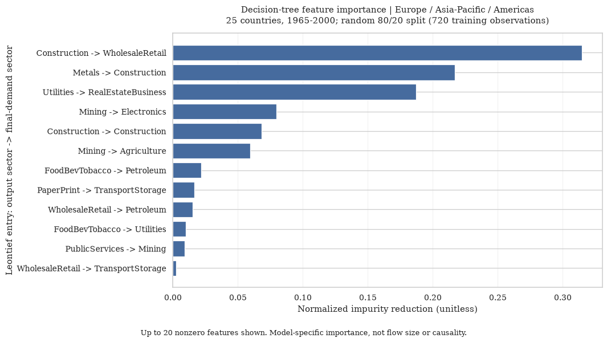

# Reading the charts

The project uses three different kinds of numbers. Their units are not interchangeable.

| Visualization | What is plotted | Scale |
| --- | --- | --- |
| Transaction heatmap | Domestic transactions from producing sector (row) to consuming sector (column) | Billions of current USD, after dividing the source values by 1,000 |
| Sector linkage ranking | Mean of each sector's row mean and column mean in the Leontief inverse | Unitless coefficient |
| Decision-tree feature ranking | Contribution of each matrix entry to the fitted tree's impurity reduction | Unitless importance, normalized across all features to sum to 1 |

## Sector linkage chart

The source [Long-run WIOD tables](https://www.rug.nl/ggdc/valuechain/long-run-wiod) report transactions in **millions of current US dollars**. However, the bar chart is computed from the Leontief inverse, not the original monetary transaction matrix.

The notebook first divides transaction amounts by sector gross output to obtain input coefficients, then computes `L = inverse(I - A)`. Monetary units cancel in the division. An entry `L[i, j]` expresses sector i's output requirement per unit of demand for sector j under the model. In this domestic model, demand outside domestic intermediate use includes exports; see [methodology](methodology.md).

For 23 sectors, the plotted score is:

```text
score[i] = (mean(L[i, :]) + mean(L[:, i])) / 2
```

The row describes a sector's output response across demand destinations; the column describes all sectors' output requirements for demand in that sector. Diagonal entries are included. Averaging them gives a descriptive summary of both directions, not a standard dollar total or a causal ranking. A score of 0.14 therefore means neither $0.14 billion nor 14% of national output.

The current chart sorts these unchanged scores and identifies the selected country and year in its title.

## Decision-tree feature chart

The former title, "Top 20 Most Important Sector-to-Sector Flows," was misleading: this chart ranks **predictive features**, not transactions by dollar size.

For the three-region tree, the data covers all 25 countries and 1965-2000: 900 country-year observations, split randomly into 720 training and 180 test observations. The importance values come from the fitted training tree. They are not specific to USA 2000 or any single country-year.

An importance of 0.31 means roughly 31% of the tree's normalized, sample-weighted impurity reduction is attributed to that feature. It does not mean 31% of economic activity. Correlated predictors and the fitted tree structure affect this ranking; it is not causal evidence. The criterion selected by tuning may be Gini or entropy.

Labels identify an entry of the Leontief inverse as `output sector -> final-demand sector`. The current charts include the label scheme, country/year coverage, split, training count, and unitless axis. They show up to 20 nonzero features so zero-importance entries do not imply additional findings.



## Suggested next visualizations

- **Largest actual intersectoral transactions:** rank off-diagonal entries of the original transaction matrix for a selected country and year. Label the axis "Billions of current USD" and identify producer and consumer. This directly answers which industries trade the largest amounts with each other. Show self-transactions separately if included.
- **Sector linkage changes over time:** compare the same sectors in two selected years for one country with a slope chart. Keep the linkage definition and axis scale fixed; these remain unitless scores.
- **Regional classification errors:** show the 1991-2000 holdout confusion matrix, with counts and within-region percentages. State the 1965-1990 training period and compare with the majority-region baseline to make class imbalance visible.

For a multi-year transaction ranking, specify whether bars show annual averages or cumulative sums. Nominal-dollar comparisons across years mix changes in prices, exchange rates, and real activity; they should not be labeled real growth.
